# 📞 ElderlyVoice - Smart Medication Reminder System
 
<div align="center">


**AI-Powered Medication Reminders with Phone Calls, Voice Recording & Advanced Scheduling**

[](https://aws.amazon.com/)
[](https://javascript.info/)
[](LICENSE)
[](https://github.com/yourusername/elderlyvoice)

[Demo](#-demo) • [Features](#-features) • [Quick Start](#-quick-start) • [Documentation](#-documentation) • [Contributing](#-contributing)

</div>

---

## 🎯 **Project Overview**

ElderlyVoice is a comprehensive medication reminder system designed specifically for elderly care. It combines **real phone calls**, **SMS notifications**, and **email reminders** with **custom voice recording** capabilities and **advanced scheduling** to ensure seniors never miss their medications.

### 🌟 **Why ElderlyVoice?**

- **📞 Real Phone Calls**: Uses AWS Connect to make actual voice calls
- **🎤 Personal Touch**: Record your own voice for personalized reminders
- **🔄 Smart Scheduling**: Daily, weekly, monthly, or custom recurring reminders
- **📱 Multi-Channel**: Phone + SMS + Email for maximum reliability
- **👴 Senior-Friendly**: Designed specifically for elderly users
- **☁️ Cloud-Native**: Fully serverless AWS architecture

---

## ✨ **Features**

### 🎵 **Voice & Communication**
- **Custom Voice Recording**: Record personal medication reminders
- **AI Voice Generation**: Professional text-to-speech using AWS Polly
- **Real Phone Calls**: Actual outbound voice calls via Amazon Connect
- **SMS Notifications**: Backup text message reminders
- **Email with Audio**: Voice attachments in email reminders

### ⏰ **Advanced Scheduling**
- **Immediate Delivery**: Send reminders right now
- **One-Time Scheduling**: Set specific date and time
- **Daily Reminders**: Multiple times per day (morning, afternoon, evening)
- **Custom Recurring**: Every 2/3 days, weekly, bi-weekly, monthly, every 30 days
- **Long-Term Care**: Indefinite recurring reminders with optional end dates

### 🏥 **Healthcare Features**
- **Medication Management**: Track multiple medications with dosages
- **Special Instructions**: Include food, timing, or safety instructions
- **Response Tracking**: "Reply TAKEN" SMS confirmations
- **Family Notifications**: Keep family members informed
- **Healthcare Provider Integration**: Professional reminder templates

### 🔧 **Technical Features**
- **Serverless Architecture**: AWS Lambda, Connect, SES, SNS, Polly
- **Auto-Scaling**: Handles thousands of concurrent reminders
- **Error Handling**: Comprehensive fallbacks and retry logic
- **Security**: IAM-based permissions and encrypted communications
- **Monitoring**: CloudWatch logging and metrics

---

## 🏗️ **Architecture**

```mermaid
graph TB
    A[Web Interface] --> B[AWS Lambda]
    B --> C[Amazon Connect]
    B --> D[Amazon SNS]
    B --> E[Amazon SES]
    B --> F[Amazon Polly]
    B --> G[Amazon S3]
    B --> H[EventBridge]
    
    C --> I[📞 Phone Calls]
    D --> J[📱 SMS Messages]
    E --> K[📧 Email Reminders]
    F --> L[🎵 Voice Generation]
    G --> M[🗄️ Voice Storage]
    H --> N[⏰ Scheduling]
    
    style A fill:#e1f5fe
    style B fill:#fff3e0
    style C fill:#f3e5f5
    style D fill:#e8f5e8
    style E fill:#fce4ec
    style F fill:#f1f8e9
    style G fill:#e0f2f1
    style H fill:#fff9c4
```



### **AWS Services Used:**
- **Lambda**: Main application logic and API endpoints
- **Connect**: Outbound voice call management
- **SES**: Email delivery with voice attachments
- **SNS**: SMS notification delivery
- **Polly**: AI voice generation and text-to-speech
- **S3**: Voice file storage for Connect playback
- **EventBridge**: Advanced scheduling and recurring reminders
- **CloudWatch**: Logging, monitoring, and error tracking

---
## 📸 Screenshots

### Main Interface


### Voice Recording

  

### Advanced Scheduling


## 🚀 **Quick Start**

### **Prerequisites**
- AWS Account with appropriate permissions
- Node.js 18+ and npm
- Basic understanding of AWS services

### **1. Clone the Repository**
```bash
git clone https://github.com/yourusername/elderlyvoice.git
cd elderlyvoice
```

### **2. Install Dependencies**
```bash
npm install
```

### **3. AWS Setup**
```bash
# Configure AWS CLI
aws configure

# Create S3 bucket for voice files
aws s3 mb s3://elderlyvoice-audio-files --region us-east-1
```

### **4. Set Up Amazon Connect**
1. Go to [AWS Connect Console](https://console.aws.amazon.com/connect/)
2. Click "Get started" → Create instance
3. Claim a phone number
4. Create basic contact flow for medication reminders
5. Note your Instance ID and Contact Flow ID

### **5. Deploy Lambda Function**
```bash
# Package the function
npm run package

# Deploy to AWS Lambda
aws lambda create-function \
    --function-name elderlyvoice-reminders \
    --runtime nodejs18.x \
    --role arn:aws:iam::YOUR-ACCOUNT:role/elderlyvoice-lambda-role \
    --handler index.handler \
    --zip-file fileb://elderlyvoice.zip
```

### **6. Configure Environment Variables**
```bash
aws lambda update-function-configuration \
    --function-name elderlyvoice-reminders \
    --environment Variables='{
        "CONNECT_INSTANCE_ID":"your-instance-id",
        "CONNECT_CONTACT_FLOW_ID":"your-flow-id",
        "CONNECT_SOURCE_PHONE":"+1234567890",
        "S3_VOICE_BUCKET":"elderlyvoice-audio-files"
    }'
```

### **7. Set Up Function URL**
```bash
aws lambda create-function-url-config \
    --function-name elderlyvoice-reminders \
    --auth-type NONE \
    --cors AllowOrigins="*",AllowMethods="*",AllowHeaders="*"
```

### **8. Update Frontend**
Edit `index.html` and update the `LAMBDA_URL` variable:
```javascript
const LAMBDA_URL = 'https://your-lambda-url.lambda-url.us-east-1.on.aws/';
```

---

## 📖 **Documentation**

### **API Endpoints**

#### **Send Immediate Reminder**
```javascript
POST /
{
    "action": "send_reminder",
    "seniorName": "Eleanor Johnson",
    "seniorPhone": "+15551234567",
    "seniorEmail": "eleanor@email.com",
    "medicationName": "Lisinopril",
    "medicationDosage": "10mg",
    "voiceType": "caring",
    "deliveryMethod": "all",
    "scheduleType": "now"
}
```

#### **Schedule Recurring Reminder**
```javascript
POST /
{
    "action": "send_reminder",
    "seniorName": "John Smith",
    "seniorPhone": "+15559876543", 
    "medicationName": "Metformin",
    "voiceType": "professional",
    "deliveryMethod": "call",
    "scheduleType": "custom",
    "scheduleData": {
        "type": "recurring",
        "pattern": "every30days",
        "time": "09:00",
        "startDate": "2025-08-05"
    }
}
```

#### **Custom Voice Reminder**
```javascript
POST /
{
    "action": "send_reminder",
    "seniorName": "Mary Williams",
    "seniorPhone": "+15551112222",
    "medicationName": "Insulin",
    "voiceType": "custom",
    "customVoiceData": "base64-encoded-audio-data",
    "customVoiceFormat": "mp3",
    "deliveryMethod": "all",
    "scheduleType": "daily",
    "scheduleData": {
        "type": "daily",
        "times": ["08:00", "20:00"],
        "startDate": "2025-08-05"
    }
}
```

### **Voice Types**
- `gentle`: Soft, slow, caring tone (Joanna voice)
- `caring`: Warm, loving, supportive (Amy voice)
- `professional`: Clear, medical, authoritative (Matthew voice)
- `encouraging`: Upbeat, motivational, positive (Amy voice)
- `custom`: Your own recorded voice

### **Delivery Methods**
- `call`: Phone call only
- `sms`: SMS text message only  
- `email`: Email with voice attachment only
- `all`: Phone call + SMS + Email (recommended)

### **Schedule Types**
- `now`: Immediate delivery
- `once`: Single scheduled delivery
- `daily`: Daily recurring reminders
- `custom`: Custom recurring patterns (every X days, weekly, monthly)

---

## 🔧 **Configuration**

### **Environment Variables**
```bash
# Required AWS Connect Settings
CONNECT_INSTANCE_ID=12345678-1234-1234-1234-123456789012
CONNECT_CONTACT_FLOW_ID=87654321-4321-4321-4321-210987654321
CONNECT_SOURCE_PHONE=+15551234567

# Storage Settings  
S3_VOICE_BUCKET=elderlyvoice-audio-files

# Optional Settings
AWS_REGION=us-east-1
LOG_LEVEL=INFO
```

### **IAM Permissions**
```json
{
    "Version": "2012-10-17",
    "Statement": [
        {
            "Effect": "Allow",
            "Action": [
                "connect:StartOutboundVoiceContact",
                "polly:SynthesizeSpeech",
                "ses:SendEmail",
                "ses:SendRawEmail", 
                "sns:Publish",
                "s3:PutObject",
                "s3:GetObject",
                "events:PutEvents",
                "logs:CreateLogStream",
                "logs:PutLogEvents"
            ],
            "Resource": "*"
        }
    ]
}
```

---

## 📱 **Usage Examples**

### **Simple Medication Reminder**
```bash
curl -X POST https://your-lambda-url.lambda-url.us-east-1.on.aws/ \
  -H "Content-Type: application/json" \
  -d '{
    "action": "send_reminder",
    "seniorName": "Grandma Rose",
    "seniorPhone": "+15551234567",
    "medicationName": "Blood Pressure Pills",
    "voiceType": "caring",
    "deliveryMethod": "all",
    "scheduleType": "now"
  }'
```

### **Daily Morning Reminder**
```bash
curl -X POST https://your-lambda-url.lambda-url.us-east-1.on.aws/ \
  -H "Content-Type: application/json" \
  -d '{
    "action": "send_reminder",
    "seniorName": "Dad",
    "seniorPhone": "+15559876543",
    "medicationName": "Heart Medication",
    "voiceType": "professional",
    "deliveryMethod": "call",
    "scheduleType": "daily",
    "scheduleData": {
      "type": "daily",
      "times": ["08:00"],
      "startDate": "2025-08-05"
    }
  }'
```

### **Monthly Refill Reminder**
```bash
curl -X POST https://your-lambda-url.lambda-url.us-east-1.on.aws/ \
  -H "Content-Type: application/json" \
  -d '{
    "action": "send_reminder", 
    "seniorName": "Mom",
    "seniorPhone": "+15551112222",
    "medicationName": "Prescription Refill",
    "voiceType": "gentle",
    "deliveryMethod": "all",
    "scheduleType": "custom",
    "scheduleData": {
      "type": "recurring",
      "pattern": "every30days",
      "time": "10:00",
      "startDate": "2025-08-05"
    }
  }'
```

---

## 🧪 **Testing**

### **Test Phone Call**
```bash
# Test AWS Connect call capability
aws connect start-outbound-voice-contact \
    --instance-id $CONNECT_INSTANCE_ID \
    --contact-flow-id $CONNECT_CONTACT_FLOW_ID \
    --destination-phone-number "+15551234567" \
    --source-phone-number $CONNECT_SOURCE_PHONE \
    --region us-east-1
```

### **Test Voice Generation**
```bash
# Test AWS Polly voice synthesis
aws polly synthesize-speech \
    --text "Hello, this is a test medication reminder" \
    --voice-id "Amy" \
    --output-format "mp3" \
    --engine "neural" \
    test-voice.mp3
```

### **Unit Tests**
```bash
npm test
```

### **Integration Tests**
```bash
npm run test:integration
```

---

## 🐛 **Troubleshooting**

### **Common Issues**

#### **Phone Calls Not Working**
```bash
# Check Connect instance
aws connect describe-instance --instance-id $CONNECT_INSTANCE_ID

# Verify phone number
aws connect list-phone-numbers --instance-id $CONNECT_INSTANCE_ID

# Test contact flow
aws connect list-contact-flows --instance-id $CONNECT_INSTANCE_ID
```

#### **Voice Generation Failing**
```bash
# Check Polly permissions
aws polly describe-voices --language-code en-US

# Test voice synthesis
aws polly synthesize-speech \
    --text "Test message" \
    --voice-id "Amy" \
    --output-format "mp3" \
    test.mp3
```

#### **S3 Upload Issues**
```bash
# Check bucket exists
aws s3 ls s3://elderlyvoice-audio-files

# Test upload permissions
aws s3 cp test-file.mp3 s3://elderlyvoice-audio-files/test/
```

#### **Email Attachments Missing**
- Check CloudWatch logs for voice generation errors
- Verify SES permissions for raw email sending
- Ensure audio data is properly base64 encoded

### **Debug Mode**
Set `LOG_LEVEL=DEBUG` in environment variables for detailed logging.

### **CloudWatch Logs**
```bash
# View Lambda logs
aws logs describe-log-groups --log-group-name-prefix /aws/lambda/elderlyvoice

# Stream logs in real-time
aws logs tail /aws/lambda/elderlyvoice-reminders --follow
```

---

## 💰 **Cost Estimation**

### **Monthly Costs (estimated)**
- **Lambda**: ~$0.20 per 1000 executions
- **Connect**: ~$0.018 per minute of calls + $0.03/day for phone number
- **SES**: ~$0.10 per 1000 emails
- **SNS**: ~$0.75 per 1000 SMS messages
- **Polly**: ~$4.00 per million characters
- **S3**: ~$0.023 per GB of voice files

**Example**: 100 daily reminders = ~$15-25/month

### **Cost Optimization Tips**
- Use scheduling to avoid duplicate reminders
- Implement SMS confirmations to reduce unnecessary calls
- Set up billing alerts for unexpected usage
- Use S3 lifecycle policies to delete old voice files

---

## 🔒 **Security**

### **Data Protection**
- All communications encrypted in transit (TLS)
- Voice recordings stored securely in S3
- No sensitive data logged in CloudWatch
- IAM least-privilege access principles

### **Privacy Considerations**
- Voice recordings are temporarily stored for playback
- No persistent storage of personal health information
- HIPAA-compliant architecture possible with AWS Business Associate Agreement
- User consent required for voice recording

### **Access Control**
- Lambda function isolated with specific IAM role
- S3 bucket access restricted to Lambda function
- Connect instance permissions limited to medication reminders
- API Gateway integration possible for authentication

---

## 🔮 **Roadmap**

### **Version 2.1 (Q4 2025)**
- [ ] Mobile app for iOS/Android
- [ ] Web dashboard for families
- [ ] Multiple language support
- [ ] Advanced analytics and reporting

### **Version 2.2 (Q1 2026)**
- [ ] Integration with pharmacy systems
- [ ] Doctor portal for prescription management
- [ ] AI-powered medication adherence insights
- [ ] Wearable device integration

### **Version 3.0 (Q2 2026)**
- [ ] HIPAA-compliant healthcare version
- [ ] Multi-tenant architecture for healthcare providers
- [ ] Advanced scheduling with medication interactions
- [ ] Real-time medication tracking

---

### **Development Setup**
```bash
# Clone and setup
git clone https://github.com/yourusername/elderlyvoice.git
cd elderlyvoice
npm install

# Create feature branch
git checkout -b feature/your-feature-name

# Make changes and test
npm test
npm run test:integration

# Submit pull request
```

### **Code Style**
- Use ESLint configuration provided
- Follow AWS Lambda best practices
- Add comprehensive error handling
- Include unit tests for new features
- Update documentation for API changes

### **Issues and Feature Requests**
- Use GitHub Issues for bug reports
- Use Discussion for feature requests
- Check existing issues before creating new ones
- Provide detailed reproduction steps

---

## 🙏 **Acknowledgments**

- AWS for providing comprehensive cloud services
- The open-source community for inspiration and tools
- Healthcare providers who provided feedback and requirements
- Families using ElderlyVoice for their loved ones

---

**⭐ Star this repo if ElderlyVoice helps your family!**

**Made with ❤️ for elderly care and family peace of mind**

</div>
